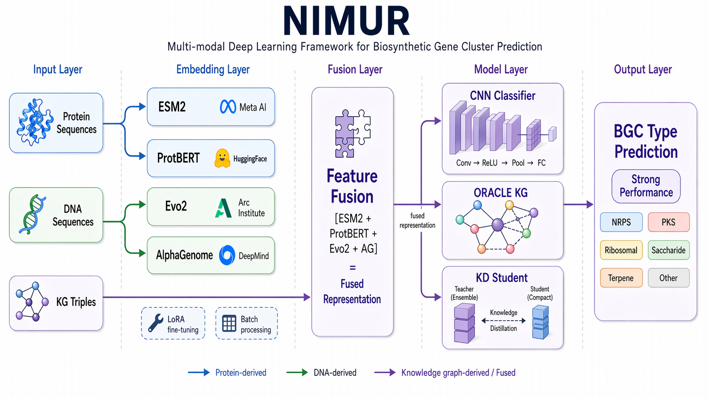

# NIMUR




**NIMUR (Neural Integrated Multi-Representation)** is a multi-modal deep learning framework for **biosynthetic gene cluster (BGC) prediction**.  
It integrates **protein embeddings**, **DNA embeddings**, and **knowledge-graph modeling** for **6-class BGC classification**, genome-scale scanning, and efficient downstream deployment.

[](https://www.python.org/downloads/)
[](https://pytorch.org/)
[](LICENSE)

---

## Features

- Multi-modal fusion of **ESM2**, **ProtBERT**, **Evo2**, and **AlphaGenome**
- Support for **CNN**, **knowledge-graph**, and **KD-fusion** training
- **6-class** BGC prediction: NRPS, PKS, Ribosomal, Saccharide, Terpene, Other
- **Genome-wide scanning** for candidate BGC region detection
- **LoRA fine-tuning** for efficient adaptation

---

## Architecture

```text
Protein Sequences ──> ESM2 (1280d)
                  └─> ProtBERT (1024d)

DNA Sequences ─────> Evo2 (1920d)
                  └─> AlphaGenome (1536d)

KG Triples ────────> ORACLE KG

[ESM2 + ProtBERT + Evo2 + AlphaGenome] = 5760d
                      │
                      ├─> CNN Classifier
                      ├─> KD Student
                      └─> KG Model
                            │
                            └─> 6-class BGC prediction
```

---

## Installation

```bash
git clone https://github.com/your-org/nimrod.git
cd nimrod

conda create -n nimrod python=3.10 -y
conda activate nimrod

pip install torch torchvision torchaudio --index-url https://download.pytorch.org/whl/cu118
pip install fair-esm
pip install evo2
```

---

## Quick Start

### 1. Prepare data

```bash
python scripts/data_prep/split_mibig_bgc_fasta.py \
    --input data/MiBiG_formatted_BGC.fasta \
    --out-dir data/mibig_splits
```

### 2. Build embeddings

```bash
python scripts/data_prep/build_esm_protbert_dataset.py \
    --train-pos-faa data/train_pos.fasta \
    --train-neg-faa data/train_neg.fasta \
    --protbert local_assets/data/ProtBERT/ProtBERT \
    --out data/esm_protbert_features.pt
```

### 3. Train KD-Fusion

```bash
bash scripts/pipeline/pipeline.sh \
    --target kd-full \
    --env nimrod \
    --gpus 0,1 \
    --train-pos data/train_pos.fasta \
    --train-neg data/train_neg.fasta \
    --valid-pos data/valid_pos.fasta \
    --valid-neg data/valid_neg.fasta
```

### 4. Predict

```bash
python predict/predict.py \
    --model results_tune/kd_fusion/run0/models/kd_best.pt \
    --fasta input/sequences.fasta \
    --out predictions.csv
```

---

## Inference

### Single-sequence prediction

```bash
python predict/predict.py \
    --model results_tune/kd_fusion/run0/models/kd_best.pt \
    --fasta input/sequences.fasta \
    --out predictions.csv
```

### Genome-wide detection

```bash
python predict/kd_genome_detect.py \
    --model results_tune/kd_fusion/run0/models/kd_best.pt \
    --genome-fna input/genome.fna \
    --out-dir results/genome_scan
```

---

## Backbones

| Model | Modality | Dimension |
|------|----------|-----------|
| ESM2 | Protein | 1280 |
| ProtBERT | Protein | 1024 |
| Evo2 | DNA | 1920 |
| AlphaGenome | DNA | 1536 |

> Note: Evo2 may require **~28GB VRAM** for long-context inference.

---

## Performance

TBD

---

## Project Structure

```text
nimrod/
├── scripts/
├── utils/
├── predict/
├── config/
├── data/
├── results_tune/
├── local_assets/
└── README.md
```

---

## Citation

TBD

---
